关于提交作业
===

## 准备工作
1. 注册Github账号
2. 安装Git（命令行版）
3. 安装VSCode

## 提交方法
1. 注册Github账号，登录后访问社团作业仓库<https://github.com/yyxkj2013/tanzhijian>，点击Fork按钮

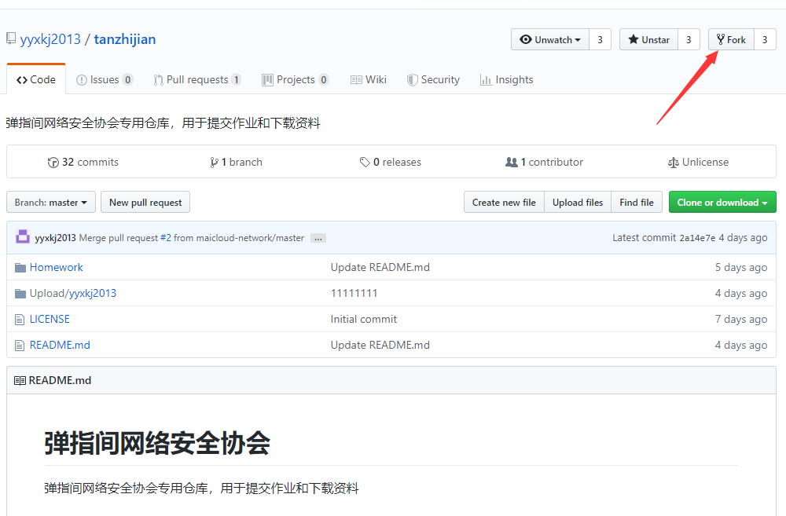
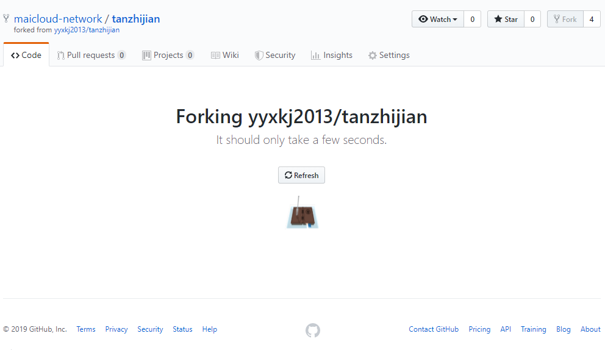

2. 随后在你的账户下会出现一个 `forked from yyxkj2013/tanzhijian` 的仓库，如图所示，复制仓库地址，进入VSCode

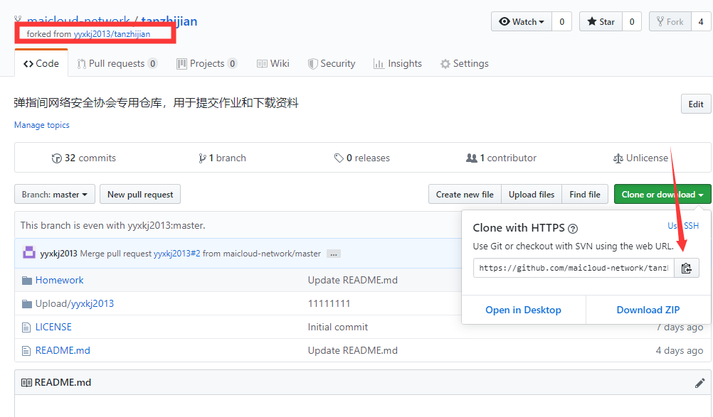

3. 进入VSCode，Terminal -> New Terminal，打开一个终端（或者使用快捷键 **Ctrl + Shift + \`** ）  
切换到一个合适的文件夹，输入：  
` git config --global user.name "username"` # 配置用户名  
` git config --global user.email "email"`  # 配置电子邮件  
 `git clone https://github.com/你的用户名/tanzhijian.git`  # 克隆仓库  


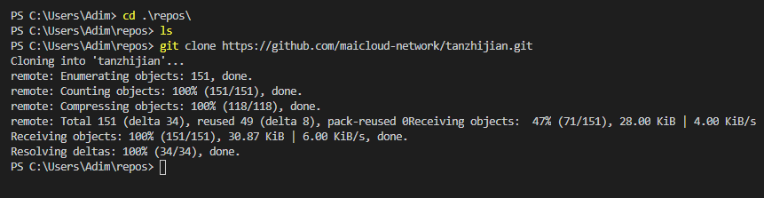  

4. 在VSCode里面打开仓库 File -> Open Folder...   ，打开刚刚克隆的仓库，在Upload文件夹内创建以下目录结构

```
Upload
    └─maicloud-network    # 文件夹名称为你的Github用户名
      └─Task1             # 第一次作业
         ├─ README.md     # 此处为你的作业内容
         └─ ...           # 如果作业内有其他文件或文件夹，放在这里
```
在README.md提交作业内容

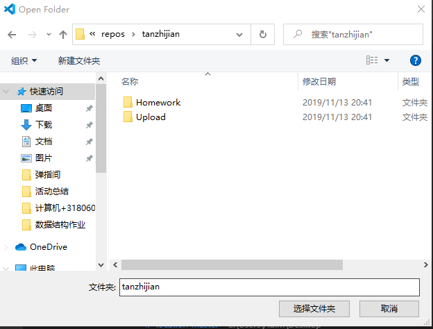  
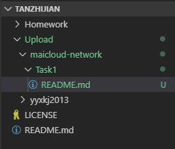  

5. 作业在保存后，点击加号，把文件放到暂存区内，当所有的修改都保存到暂存区后，点击 `Commit`，添加一段提交注释

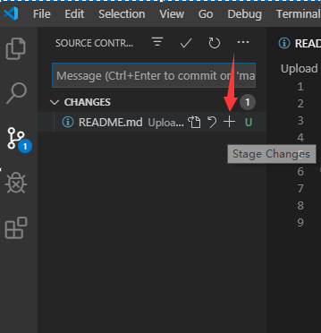  
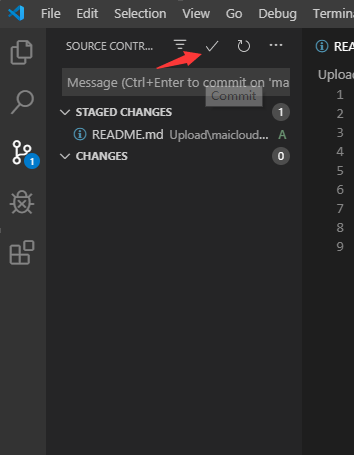  
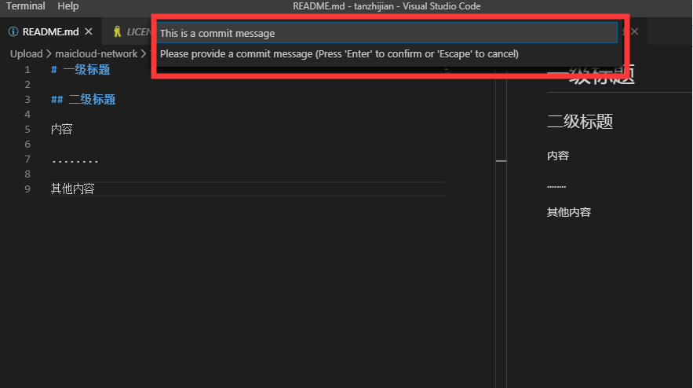  


6.  push到远程仓库，输入你的Github用户名和密码，等待一会，push成功，你的Githhub仓库里面能看见刚刚写的东西

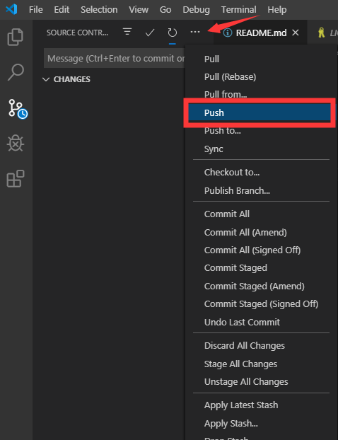  
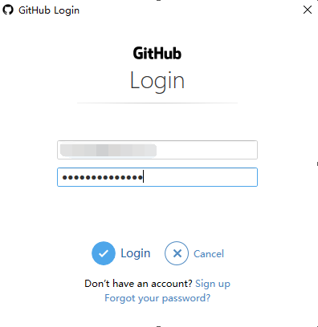  
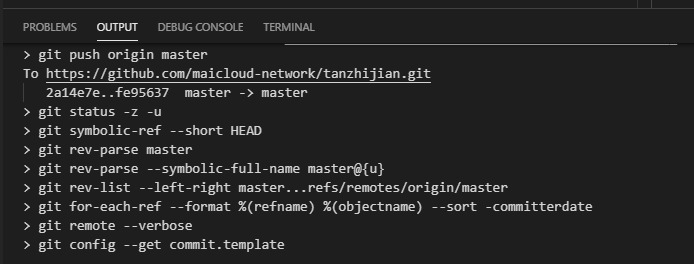  
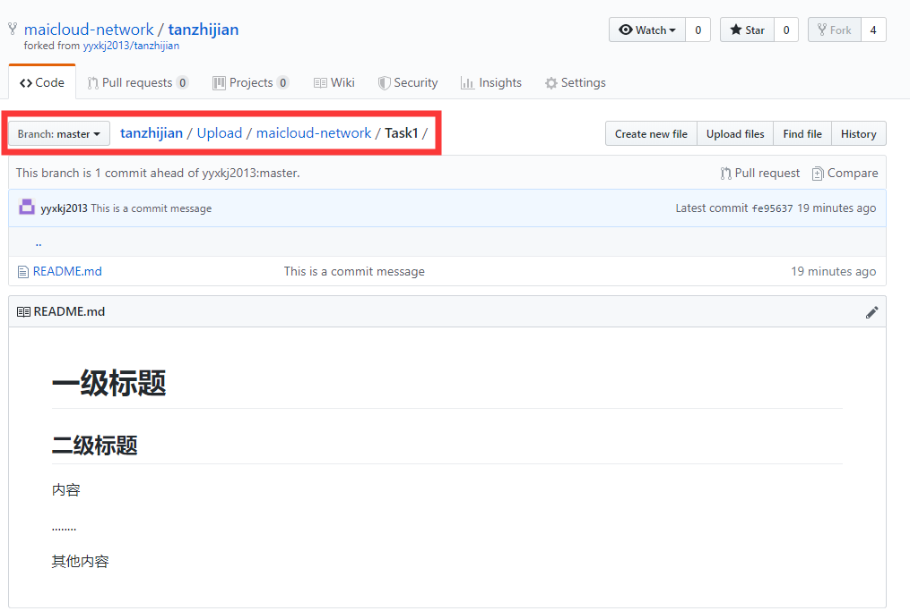  

7. 现在你需要把你仓库中的修改合并到社团主仓库 <https://github.com/yyxkj2013/tanzhijian> 中  
点击 Pull request -> Create pull request -> 写上备注 -> 提交完成

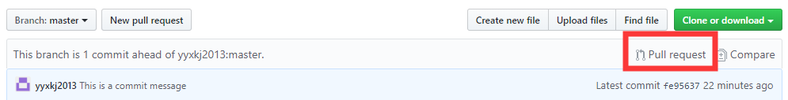  
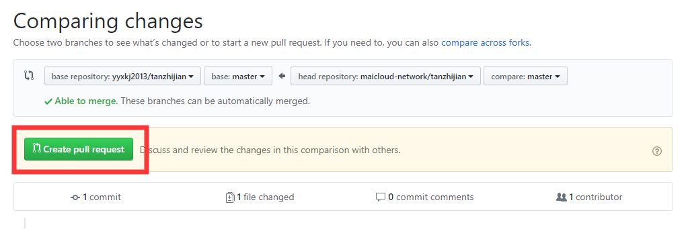  
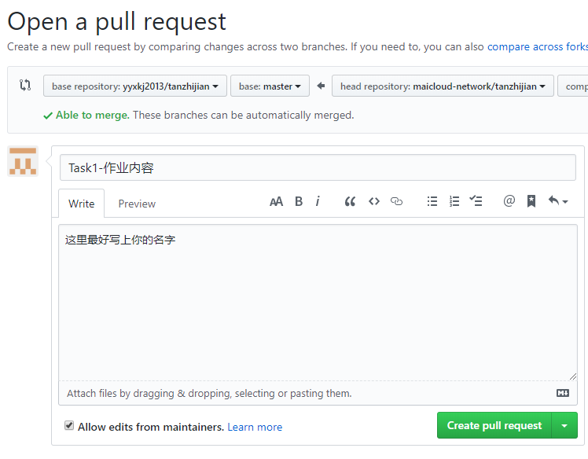  

8. 等待审核，审核完成后能在社团主仓库内看见你的文件
